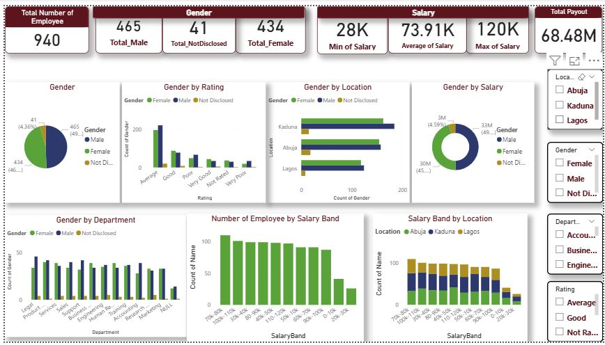

# DSA-PowerBi-Capstone-Project-
This is my PowerBi Capstone Project for Digital Skillup Africa 2025 where i analys gender inequality issue inPALMORA GROUP HR 

## The instructions 

# The analysis and the insight & Recommendation 
This report provides an overview of Palmoria’s employee data with a focus on salary structure, gender balance, departmental and regional insights, and regulatory compliance.

### 1. General Overview
Total Number of Employees: 940,
Gender Distribution:
Male: 465, 
Female: 434, 
Not disclosed: 41

---

### 2. Salary Structure
Minimum Salary: 28k
Average Salary: 73.91k
Maximum Salary: 120k
Total Salary Payout: $68.48 m

Regulatory Non-Compliance:
A new policy mandates a minimum salary of $90,000 for all manufacturing employees. However, Palmoria currently falls short, with a minimum of $28,000 and an average salary of $73,910.

---

### 3. Gender Pay Gap Analysis
Overall: Male employees earn higher average salaries than females in most departments.
Departmental Distribution:
Departments such as Services, Business, Humanitarian service are female-dominated.

Regional Gender Spread:
Across all three regions, males have the highest representation.

---

### 4. Employee Performance Ranking by Gender
Very Poor	-Male
Poor-	Male
Average	-Male
Good-	Female
Very Good-	Female
Not Rated	- Female

This breakdown suggests that while males dominate in lower and mid performance levels (Very Poor to Average), females excel more at higher ratings (Good and Very Good) and also appear more in Not Rated categories, indicating a need to improve performance tracking systems for them.

---

### 5. Key Insights & Recommendations
- Regulatory Compliance:
Immediate review of salary structure is necessary to align with the $90,000 minimum salary regulation.

- Gender Pay Gap:
Male employees consistently earn more, even in some female-dominated departments and with the good performance of the female. A gender pay review is recommended.

- Performance Management:
Males dominate the "Average" and "Poor" categories, while females perform strongly under "Good" and "Very Good". This suggests the potential benefit of performance development programs targeted by department and gender.

- Undisclosed Gender Records:
There are 41 records without gender information. Data cleansing is recommended to ensure accuracy in future reporting.

---
### The Visualization 

 
